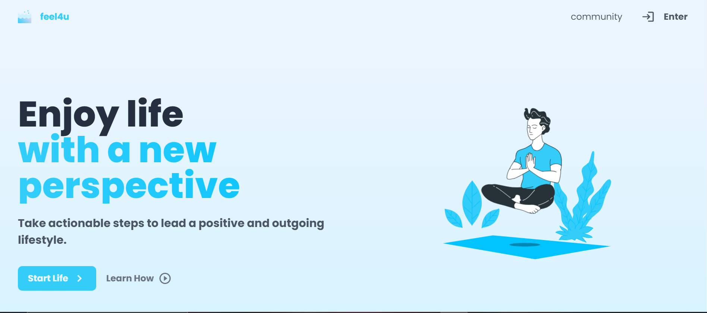

# Feel4U
Team : The Boys
We are here to have fun and innovate while having good food.

In India, it is considered to be “weak” to approach a mental counselor. So many people in need of help hesitate to seek help and thereby improve their situation.
Not addressing this may lead the person to enter a downward spiral.

What we propose is to gamify the experience of seeking help, through small tasks that give reward points on completion. Awarding points act as a positive feedback. 
These tasks will be suggested to a user based on a small questionnaire to gauge his/her mood. 
Examples can be : reading a book, going for a stroll, take dog for a walk
Awards can be : have an ice cream, give health points, go for a small picnic, play a simple game, take a nap.
Empowering people to realize their ability to take control and take actionable steps to obtain a positive impact on their mental wellbeing.

## Tech Stack

- Frontend - Nuxt
- Backend - Firebase, Neurelo, Node

## Functionality
<ol>
<li>Gauge mood of user by a simple questionnare</li>
<li>Suggest tasks to improve how user feels; share resources to guide user to complete tasks</li>
<li>Choose rewards, to motivate user to complete tasks.</li>
<li>Internationalization takes care of translating application to various languages.</li>
<li>Non-spammy advertisement to cover costs of experts.</li>
<li>Streaks to motivate users trying to improve their wellbeing.</li>
<li>Community section to help connect with individuals looking to work together to help self and others.</li>
<li>Logger stores all tasks started by user, the mental-health specialist can gauge user based on his/her history of completing tasks. This feature can further be improved by storing quiz-scores periodically to analyze how much has the application helped.</li>
<li> Connect and schedule meets with professionals, using  https://calendly.com/ </li>
</ol>

## Future scope
<ul>
<li>Doctor should have access to background of user, to provide an insight into personality and get better consultation.</li>
</ul>

## Want to contribute? 

Check out [CONTRIBUTING.md](CONTRIBUTING.md).

### The setup 
Node Version v14.16.0
Use NodeVersionManager to easily navigate through different node versions.

### Deployement Instructions
<ol>
<li>Use "cd .\frontend\" to navigate through to the frontend folder.</li>
<li>Use "node install" to install all dependencies.</li>
<li>npm run dev (refer to 'scripts' section in package.json for more scripts) to see your code running live.</li>
</ol>

## Snapshots

Home page 

Take test to gauge user

Take a task to try to improve self

Rewards for +ve feedback

Streak page to motivate user further

Work with others to help self by helping others 

This information can be analyzed and presented to the specialists to provide a better consultation

